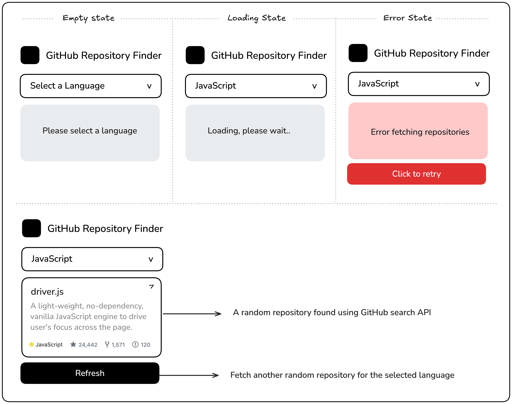

# Buscador de Repositorios Aleatorios de GitHub

¡Bienvenido al **Buscador de Repositorios Aleatorios de GitHub**! Este proyecto te permite buscar repositorios aleatorios en GitHub filtrando por lenguaje de programación. Utiliza la API de GitHub para obtener datos en tiempo real y muestra información relevante como el nombre del repositorio, la descripción, el número de estrellas, las bifurcaciones y los problemas abiertos.

## Características

- **Búsqueda por lenguaje**: Selecciona un lenguaje de programación de un menú desplegable para buscar repositorios aleatorios.
- **Información detallada**: Muestra el nombre, la descripción, las estrellas, las bifurcaciones y los problemas abiertos del repositorio.
- **Botón de actualización**: Obtén otro repositorio aleatorio con un solo clic.
- **Manejo de estados**: Interfaz de usuario receptiva que maneja estados de carga, vacío y error.

## Tecnologías Utilizadas

- **React**: Biblioteca de JavaScript para construir interfaces de usuario.
- **TypeScript**: Superconjunto de JavaScript que añade tipos estáticos.
- **GitHub API**: Para obtener datos de repositorios aleatorios.
- **Fetch API**: Para realizar solicitudes HTTP a la API de GitHub.
- **TailwindCSS**: Para estilizar la aplicación.

## Captura de Pantalla



## Cómo Empezar

Sigue estos pasos para configurar y ejecutar el proyecto en tu máquina local.

### Requisitos Previos

- **Node.js**: Asegúrate de tener Node.js instalado. Puedes descargarlo [aquí](https://nodejs.org/).
- **Git**: Clona este repositorio usando Git. Si no lo tienes, descárgalo [aquí](https://git-scm.com/).

### Instalación

1. Clona el repositorio:

   ```bash
   git clone https://github.com/tu-usuario/buscador-repositorios-github.git

   ```

2. Navega al directorio del proyecto:

bash
Copy
cd buscador-repositorios-github
